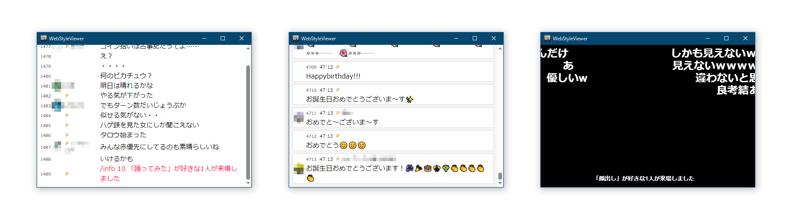
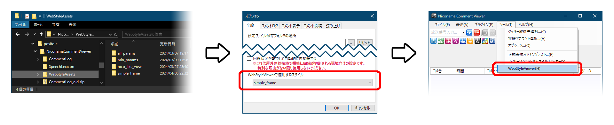

# NCV-WebStyleViewer-assets
ニコニコ生放送専用コメントビューア [**NCV** (NiconamaCommentViewer)](https://www.posite-c.com/application/ncv/) で WebStyleViewer 利用時に適用されるHTML素材です。  
WebStyleViewer は HTML、CSS、JavaScript などで見た目や動作処理を自由にカスタマイズ可能な **NCV** の新しい表示機能です。  
最低限コメントを渡すための関数を用意すればその関数の中身も含めすべての処理を利用者側で自由に書くことができ、グラフィカルな描画やアニメーションなど多彩な表示方法が実現できます。
## 使用例

## 利用方法　カスタム設定変更手順
1. 設定フォルダを用意して必要なファイルを揃える  
　設定フォルダはインストールフォルダ直下にある webStyleAssets フォルダか、またはアプリケーション設定保存フォルダ内に WebStyleAssets という名前のフォルダを作成してその中に配置してください。  
　両方に同名の設定フォルダが存在した場合はインストールフォルダ側が優先されます。
2. NCVを起動して 「オプション... → 全般 → WebStyleViewerで適用するhtml設定」 から任意の設定を選択する  
　ここに表示される設定名はインストールフォルダ直下、またはアプリケーション設定保存フォルダ直下の webStyleAssets フォルダ内に存在する各設定フォルダ名です。  
　設定フォルダ一覧が取得されるのはオプションウィンドウを開いたときなのでNCVは起動したまま作業しても大丈夫です。
3. 「ツール → WebStyleViewer」を起動する  
　番組に接続する度にその時点で選択されている設定が読み込まれるので WebStyleViewer を開いたままでも次の接続時に新しい設定が読み込まれます。
> [!NOTE]
> ユーザーアイコンが表示可能なスタイル設定でユーザーアイコンを表示するには、NCV本体でのユーザーアイコン表示が有効になっている必要があります。


***
## 構成
[assets](./assets) 以下、各設定をディレクトリ単位で管理します。  
独自のカスタム設定を使用する場合は、アプリケーション設定保存フォルダ ( `%APPDATA%\posite-c\NiconamaCommentViewer` ) 内に **WebStyleAssets** フォルダを作成し、その中で各設定ごとにフォルダ分けします。
```
 posite-c  
 └── NiconamaCommentViewer  
     ├── CommentLog  
     ├── SpeechLexicon  
     └── WebStyleAssets  
         ├── Sample01  
         ├── Sample02  
         └── Sample03
```
## カスタム設定作成規則
最低限 **index.html** と **comment.html** は必須です。  
コメントを新規受信する毎にベースとなる index.html へコメント一つ分の表示データを反映した comment.html 内のHTMLタグを渡していきます。
### index.html
NCVで WebStyleViewer を開いたときや番組切り替えの度に読み込まれます。  
外部へのアクセスはデフォルトではできないようにしてあります。（手動で設定ファイルを追加することでできるようにしてもいいかも）  
以下は最小限の構成です。
```html
<!DOCTYPE html>
<html lang="ja">
<head>
<meta charset="UTF-8">
<meta name="viewport" content="width=device-width, initial-scale=1.0">
</head>
<body>
<div id="comment-panel"></div>
<script language="javascript" type="text/javascript">
function addNewComment(comment) {
  document.getElementById('comment-panel').insertAdjacentHTML('beforeend', comment);
}
</script>
</body>
</html>
```

`addNewComment()` はコメント追加用の関数で、新規コメント受信の度にNCV本体から呼ばれるため必須です。中身の処理は行いたい演出に応じて自由に書き換えてください。  
引数は comment.html に記載されたテンプレートタグにコメントデータを反映させたHTMLタグです。  
```js
function addNewComment(comment) {
  document.getElementById('comment-panel').insertAdjacentHTML('beforeend', comment);
}
```
#### ユーザーアイコンを表示する方法
NCV本体でのユーザーアイコン表示が有効になっていて、index.html 内に `addUserIcon()` 関数の存在が確認されたときのみ取得された画像がBase64エンコードされ、文字列として WebStyleViewer に渡されます。  
画面上への描画はコメント受信の際にJavaScriptなどで処理して行なってください。  
NCV本体から画像データが送られるタイミングは WebStyleViewer の初回起動時（画像データを持っている場合）と、接続中の新規画像取得時のみです。  

`addUserIcon()` はユーザーアイコン画像の追加関数であり、取得した画像データをNCV本体から渡します。  
第一引数はユーザーID、第二引数はBase64エンコードされたアイコン画像です。  
```js
const userIconMap = new Map();
function addUserIcon(userId, image) {
  userIconMap.set(userId, image);
  // 画像取得完了よりコメント反映の方が早いので初回登録時は少し遡って適用する必要あり
  　　　・
  　　　・
  　　　・
}
```
以後新規取得コメントへはユーザーIDを判別したのち適宜ユーザーアイコンの表示を行なってください。
#### ギフト画像を表示する方法 (0.221.2.101 以降)
index.html 内に `addGiftImage()` 関数の存在が確認されたときのみ取得された画像がBase64エンコードされ、文字列として WebStyleViewer に渡されます。  
画面上への描画はコメント受信の際にJavaScriptなどで処理して行なってください。  

`addGiftImage()` はギフト画像の追加関数であり、取得した画像データをNCV本体から渡します。  
第一引数はギフトID、第二引数はBase64エンコードされたギフト画像です。  
```js
const giftImageMap = new Map();
function addGiftImage(giftId, image) {
  giftImageMap.set(giftId, image);
  // 画像取得完了よりコメント反映の方が早いので初回登録時は少し遡って適用する必要あり
  　　　・
  　　　・
  　　　・
}
```
以後新規取得コメントへはギフトIDを判別したのち適宜ギフト画像の表示を行なってください。
### comment.html
コメントが受信される度に **index.html** に送られる、コメント一つ分のテンプレートタグです。  
WebStyleViewer を開いたときや番組切り替え時、初期化のタイミングでファイルが読み込まれて `CR` および `LF` が削除されて使われます。  
> [!CAUTION]
> ファイル内の指定項目が変換されたのち丸々 **index.html** へ送られるため、余分なタグやコメント等は記載しないでください。

以下は comment.html の記述例です。
```html
<div class="chat"&ANONYMITY&PREMIUM&SERVERCOMMENT&EMOTION>
<span class="chat-number">&NUMBER</span>
<span class="chat-usericon"></span>
<span class="chat-nickname">&NICKNAME</span>
<span class="chat-comment">&COMMENT</span>
<span class="chat-userid">&USERID</span>
</div>
```
#### 属性置換用変数
|変数|変換後の値|説明|
----|----|----
|&ANONYMITY|␣data-anon="1"|匿名IDコメント（なふだオフ）|
|&PREMIUM|␣data-premium="1"|プレミアムアカウント|
|&SERVERCOMMENT|␣data-server="1"|運営コメント|
|&EMOTION|␣data-emotion="1"|エモーション|
|&MAIL|␣data-mail="＜command＞"|コマンド (0.221.2.117 以降)|
|&NICOAD|␣data-nicoad="1"|ニコニ広告通知 (0.221.2.101 以降)|
|&GIFT|␣data-gift="＜gift_id＞"|ギフト通知 (0.221.2.101 以降)|

これらの情報はカスタムデータ属性として変換されるので、要素の定義内に配置してJavaScript等で処理を行ない描画に反映させてください。 
> [!NOTE]
> 各データ存在しない場合は空となります。 `="0"` とはなりません。  

#### コメントデータ置換用変数
|変数|説明|
----|----
|&NUMBER|コメント番号|
|&ELAPSEDTIME|経過時間 (0.221.2.101 以降)|
|&USERID|ユーザーID|
|&NICKNAME|ユーザー設定ニックネーム|
|&COMMENT|コメント本文|
## ライセンス
このリポジトリに含まれる各ファイルは、CC BY-NC-SA 4.0 に基づいてライセンスされています。  
詳細については、[LICENSE](./LICENSE) を参照してください。
